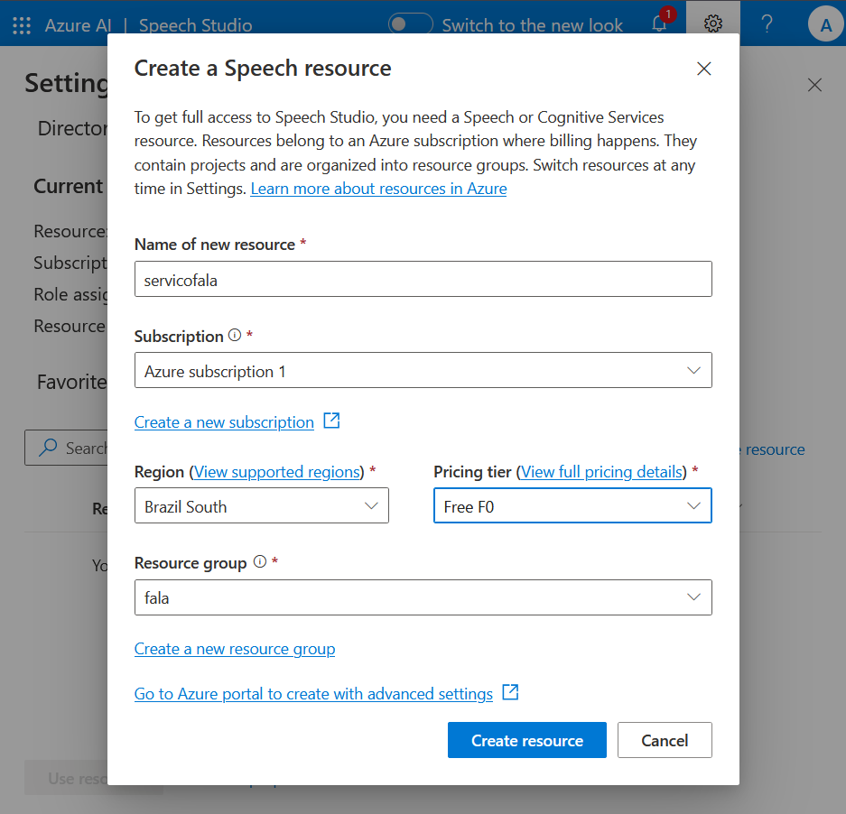
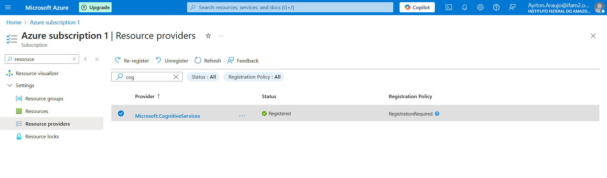
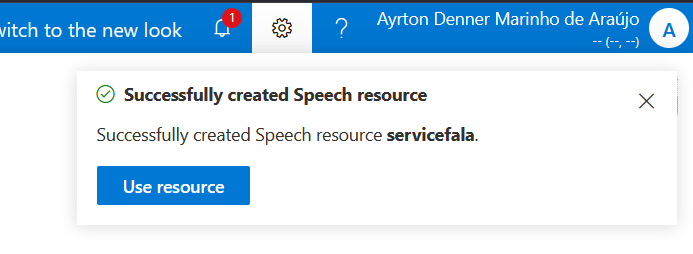
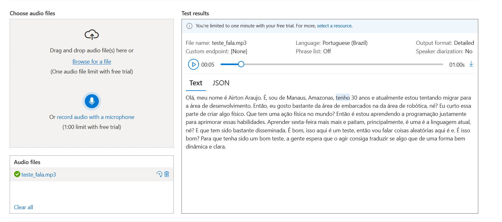
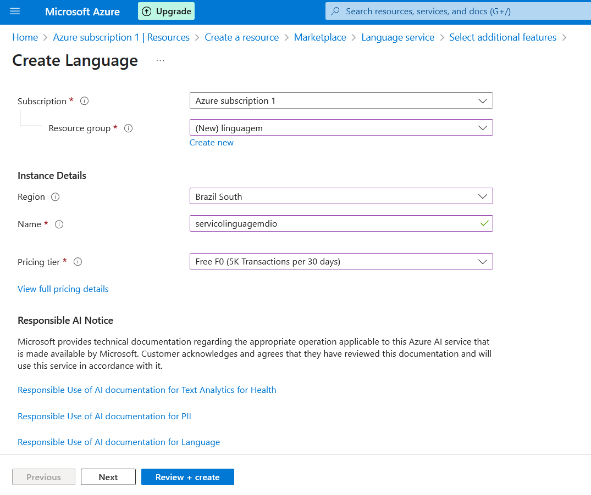
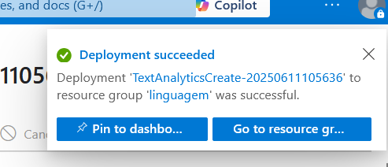
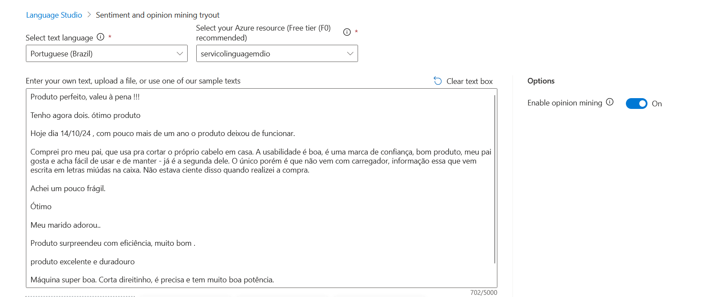

# Desafio de Projeto DIO: Análise de Fala e Linguagem com Azure AI

Este repositório documenta a execução do desafio de projeto da [DIO](https://www.dio.me/) sobre as ferramentas de Inteligência Artificial do Microsoft Azure, focando no **Speech Studio** e **Language Studio**. O objetivo foi explorar, na prática, as capacidades de transcrição de áudio e análise de sentimentos.

## Objetivos de Aprendizagem

-   Aplicar os conceitos de IA da Azure em um ambiente prático.
-   Documentar processos técnicos de forma clara e estruturada.
-   Utilizar o GitHub como ferramenta para compartilhamento de documentação técnica.

## Ferramentas Utilizadas

-   Microsoft Azure Portal
-   Azure Speech Studio
-   Azure Language Studio
-   Git & GitHub

---

## Parte 1: Azure Speech Studio (Conversão de Fala em Texto)

Nesta etapa, o foco foi utilizar o serviço de fala da Azure para converter um áudio pré-gravado em texto.

### 1.1. Criação do Recurso de Fala

O primeiro passo foi criar um `Speech Resource` no portal da Azure. As seguintes configurações foram utilizadas:

-   **Resource Group:** `fala` (novo)
-   **Region:** `Brazil South`
-   **Name:** `servicofala`
-   **Pricing tier:** `Free F0` (Oferece uma camada gratuita generosa para testes)

### 1.2. Desafio Encontrado e Solução

Durante a criação do recurso, encontrei o seguinte erro:
> `Failed to create Speech resource servicofala: Error: MissingSubscriptionRegistration. The subscription is not registered to use namespace 'Microsoft.CognitiveServices'.`

A mensagem indica que a assinatura (subscription) não estava habilitada para usar os Serviços Cognitivos.

**Solução:**
A solução envolveu registrar o provedor `Microsoft.CognitiveServices` manualmente no Azure Portal, navegando até **Assinaturas > [Sua Assinatura] > Provedores de Recursos** e ativando o serviço necessário. Para aprofundar o conhecimento sobre o tema, consultei os seguintes artigos:
- [O que são os Serviços Cognitivos do Azure? - AlfaPeople](https://alfapeople.com/br/azure-cognitive-services/)
- [O que são os Azure Cognitive Services? - Medium](https://medium.com/@habbema/azure-cognitive-services-de49b918b2a0)

Após o registro, a criação do recurso foi concluída com sucesso.

### 1.3. Teste de Transcrição (Real-time Speech to Text)

Com o serviço ativo, acessei o **Speech Studio** e utilizei a funcionalidade `Real-time speech to text`. Realizei o upload de um arquivo de áudio (`teste_fala.mp3`) contendo uma breve apresentação pessoal.

### 1.4. Resultados e Insights (Speech Studio)

O texto transcrito pelo serviço foi:

> Olá, meu nome é Airton Araujo. É, sou de Manaus, Amazonas, tenho 30 anos e atualmente estou tentando migrar para a área de desenvolvimento. Então, eu gosto bastante da área de embarcados na da área de robótica, né? Eu curto essa parte de criar algo físico. Que tem uma ação física no mundo? Então é estou aprendendo a programação justamente para aprimorar essas habilidades. Aprender sexta-feira mais mais e paitam, principalmente, é uma é a linguagem atual, né? E que tem sido bastante disseminada. É bom, isso aqui é um teste, então vou falar coisas aleatórias aqui é e. É isso bom? Para que tenha sido um bom teste, a gente espera que o agir consiga traduzir se algo que de uma forma bem dinâmica e clara.

A ferramenta demonstrou um alto grau de precisão, mas cometeu pequenos erros em palavras específicas como "C/C++" (transcrito como "sexta-feira mais mais") e "Python" (transcrito como "paitam").

**Conclusão da Etapa:** O Speech Studio é uma ferramenta poderosa com aplicações claras em **acessibilidade** (legendas automáticas, transcrição para deficientes auditivos) e na criação de **assistentes virtuais** e sistemas de comando por voz.

---

## ✍️ Parte 2: Azure Language Studio (Análise de Sentimentos)

A segunda parte do desafio focou em analisar textos para extrair sentimentos e opiniões.

### 2.1. Criação do Recurso de Linguagem

O processo iniciou com a criação de um `Language Resource` no Azure:

-   **Resource Group:** `linguagem` (novo)
-   **Region:** `Brazil South`
-   **Name:** `servicolinguagemdio`
-   **Pricing tier:** `Free F0`

O deploy do recurso foi rápido, levando cerca de 1 minuto.

### 2.2. Teste de Análise de Sentimento e Opiniões

Acessei o **Language Studio** e selecionei a funcionalidade `Analyze sentiment and mine opinions`. Para o teste, coletei **10 avaliações de clientes** de um produto no site da Amazon: [Aparador de Pelos Multi-Styler](https://www.amazon.com.br/Aparador-Pelos-Multi-Styler-GCX623-Sport/dp/B07VQWPRRD).

### 2.3. Resultados e Insights (Language Studio)

Executei a análise sobre os comentários e o serviço classificou cada um deles como **positivo, negativo ou neutro**, além de atribuir um score de confiança para cada sentimento. A ferramenta também consegue identificar opiniões sobre aspectos específicos do produto mencionados no texto.

**Conclusão da Etapa:** O Language Studio prova ser uma ferramenta valiosa para empresas que desejam **monitorar a satisfação do cliente**, analisar feedbacks de produtos em escala e automatizar a classificação de reviews, e-mails e menções em redes sociais.

## Arquivos do Projeto

-   `/images`: Pasta contendo todos os screenshots do processo.
-   `fala.json`: Arquivo JSON com o resultado detalhado da transcrição de fala.
-   `analise.json`: Arquivo JSON com o resultado completo da análise de sentimentos.
-   `teste_fala.mp3`: Áudio utilizado no teste de `Speech-to-Text`.

## Conclusão Geral

Este desafio prático foi fundamental para solidificar o entendimento sobre as poderosas ferramentas de IA do Azure. A experiência, desde a configuração inicial e resolução de problemas até a aplicação real dos serviços de fala e linguagem, demonstrou o imenso potencial dessas tecnologias para criar soluções inovadoras e inteligentes.

---

*Projeto desenvolvido por Ayrton Araújo.

*Este projeto foi realizado com o auxílio e orientação da IA Gemini do Google para resolver desafios técnicos e estruturar a documentação.*